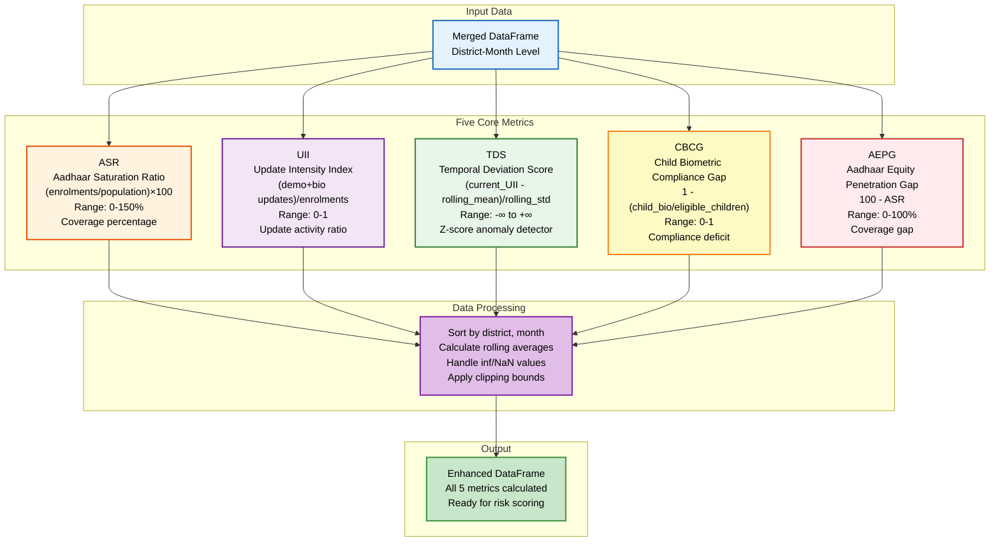
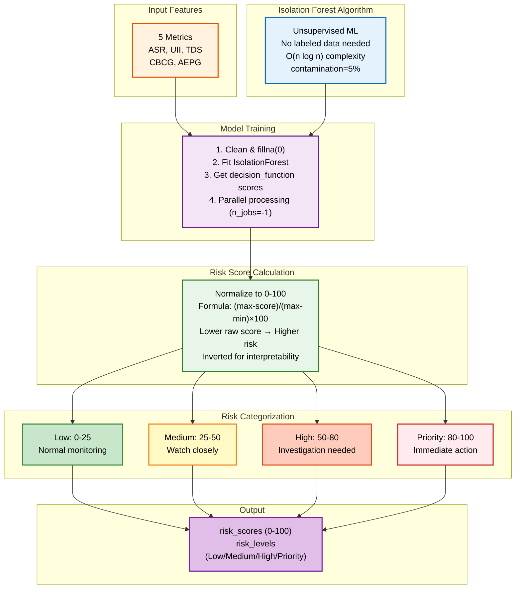
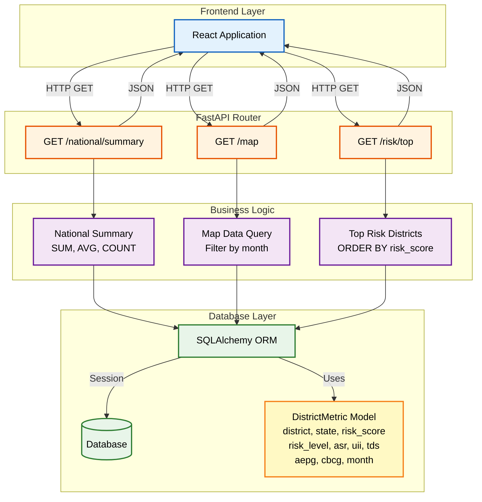
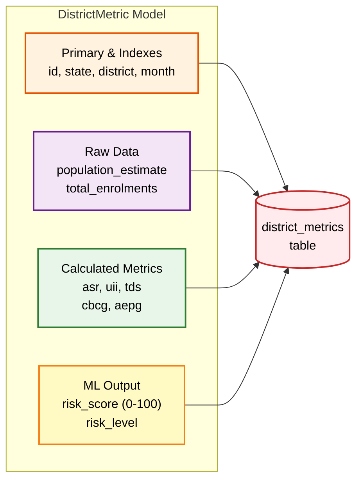

# AARI: Aadhaar Analytics & Reporting Interface

  

## Technical Submission Document

  

**Team ID**: UIDAI_6065 <br>
**Team Lead Name**: G. Sai Shankar <br>
**Teammate Name**: Chinmay Talnikar<br>


**Date**: January 2026

**Purpose**: UIDAI Aadhaar Data Analytics Hackathon

  

---

  

## 1. Problem Statement and Approach

  

### 1.1 Problem Statement

  

India's Aadhaar ecosystem is the world's largest biometric identification system, serving over 1.3 billion citizens. Managing this infrastructure presents significant analytical challenges:

  

- **Fragmented Monitoring**: District-level data exists across multiple sources (enrollment, demographic updates, biometric updates) with no unified view

- **Reactive Detection**: Anomalies indicating potential fraud or system issues take weeks to detect using manual spreadsheet analysis

- **Scale Complexity**: With 700+ districts generating millions of records monthly, pattern recognition is humanly impossible

- **Privacy Constraints**: Any monitoring solution must strictly avoid processing Personally Identifiable Information (PII)

- **Equity Gaps**: Identifying underserved populations and coverage disparities requires sophisticated metric calculation

  

### 1.2 Proposed Approach

  

**AARI (Aadhaar Analytics & Reporting Interface)** is a privacy-first analytics dashboard that addresses these challenges through:

  

1. **Aggregated Data Processing**: All analysis performed at district-month granularity, ensuring zero PII exposure

2. **Custom Metric Framework**: Five domain-specific metrics designed for Aadhaar ecosystem monitoring

3. **Unsupervised ML Detection**: Isolation Forest algorithm identifies statistical outliers without labeled training data

4. **Interactive Visualization**: Real-time MapLibre-based map with drill-down capabilities for 700 districts

5. **Assistive Intelligence**: System flags anomalies for human review, never makes autonomous decisions

  

---

  

## 2. Datasets Used

  
### 2.1 Data Sources

We utilized the official UIDAI Aadhaar datasets provided for this challenge:

| Dataset | Total Records | CSV Files | Description |
| :--- | :--- | :--- | :--- |
| **Aadhaar Enrolment** | 1,006,029 | 3 | Monthly enrollment statistics by district |
| **Demographic Updates** | 2,071,700 | 5 | Name, address, DOB, gender, mobile updates |
| **Biometric Updates** | 1,861,108 | 4 | Fingerprint, iris, face update records |
| **Total** | **4,938,837** | **12** | Combined analysis dataset |

### 2.2 Dataset Schema

**Enrolment Dataset** (`api_data_aadhar_enrolment_*.csv`)

| Column | Type | Description |
| :--- | :--- | :--- |
| `date` | String (DD-MM-YYYY) | Reporting date |
| `state` | String | State name |
| `district` | String | District name |
| `pincode` | Integer | PIN code |
| `age_0_5` | Integer | Enrollments for age 0-5 years |
| `age_5_17` | Integer | Enrollments for age 5-17 years |
| `age_18_greater` | Integer | Enrollments for age 18+ years |

**Demographic Update Dataset** (`api_data_aadhar_demographic_*.csv`)

| Column | Type | Description |
| :--- | :--- | :--- |
| `date` | String (DD-MM-YYYY) | Reporting date |
| `state` | String | State name |
| `district` | String | District name |
| `pincode` | Integer | PIN code |
| `demo_age_5_17` | Integer | Demographic updates for age 5-17 |
| `demo_age_17_` | Integer | Demographic updates for age 17+ |

**Biometric Update Dataset** (`api_data_aadhar_biometric_*.csv`)

| Column | Type | Description |
| :--- | :--- | :--- |
| `date` | String (DD-MM-YYYY) | Reporting date |
| `state` | String | State name |
| `district` | String | District name |
| `pincode` | Integer | PIN code |
| `bio_age_5_17` | Integer | Biometric updates for age 5-17 |
| `bio_age_17_` | Integer | Biometric updates for age 17+ |

  

---

  

## 3. Methodology

  

### 3.1 Data Loading and Concatenation

  

Multiple CSV files per dataset were loaded and concatenated into unified DataFrames:

  

```python

import pandas as pd

import numpy as np

import glob

import os

  

class DataLoader:

@staticmethod

def load_dataset(folder_path: str) -> pd.DataFrame:

"""Loads all CSVs in a directory and concatenates them."""

all_files = glob.glob(os.path.join(folder_path, "*.csv"))

if not all_files:

print(f"Warning: No CSV files found in {folder_path}")

return pd.DataFrame()

  

df_list = []

for filename in all_files:

try:

df = pd.read_csv(filename)

df_list.append(df)

except Exception as e:

print(f"Error reading {filename}: {e}")

  

full_df = pd.concat(df_list, ignore_index=True)

return DataLoader.normalize_columns(full_df)

  

@staticmethod

def normalize_columns(df: pd.DataFrame) -> pd.DataFrame:

"""Standardizes column names to snake_case."""

df.columns = (df.columns.str.strip()

.str.lower()

.str.replace(' ', '_')

.str.replace('-', '_'))

return df

```

  

### 3.2 Data Preprocessing

  ```mermaid
graph TB
    subgraph Input[" Input DataFrames "]
        A["enrol_df<br/>age_0_5, age_5_17<br/>age_18_greater, date"]
        B["demo_df<br/>demo_age_5_17<br/>demo_age_17_"]
        C["bio_df<br/>bio_age_5_17<br/>bio_age_17_"]
    end
    
    subgraph Process[" MetricEngine.calculate_metrics "]
        D["Standardize Dates<br/>date → month (YYYY-MM)"]
        E["Aggregate Enrollments<br/>GROUP BY state, district, month<br/>SUM age groups"]
        F["Aggregate Demographics<br/>GROUP BY state, district, month<br/>SUM demo updates"]
        G["Aggregate Biometrics<br/>GROUP BY state, district, month<br/>SUM bio updates"]
    end
    
    subgraph Calcs[" Calculations "]
        H["total_enrolments =<br/>age_0_5 + age_5_17<br/>+ age_18_greater"]
        I["total_demo_updates =<br/>demo_age_5_17<br/>+ demo_age_17_"]
        J["total_bio_updates =<br/>bio_age_5_17<br/>+ bio_age_17_"]
    end
    
    subgraph Output[" Output "]
        K["Merged DataFrame<br/>District-Month Level<br/>All metrics + totals"]
    end
    
    A --> D --> E --> H
    B --> F --> I
    C --> G --> J
    
    H --> K
    I --> K
    J --> K
    
    style A fill:#e3f2fd,stroke:#1565c0,stroke-width:2px,color:#000
    style B fill:#e3f2fd,stroke:#1565c0,stroke-width:2px,color:#000
    style C fill:#e3f2fd,stroke:#1565c0,stroke-width:2px,color:#000
    style D fill:#fff3e0,stroke:#e65100,stroke-width:2px,color:#000
    style E fill:#f3e5f5,stroke:#6a1b9a,stroke-width:2px,color:#000
    style F fill:#f3e5f5,stroke:#6a1b9a,stroke-width:2px,color:#000
    style G fill:#f3e5f5,stroke:#6a1b9a,stroke-width:2px,color:#000
    style H fill:#e8f5e9,stroke:#2e7d32,stroke-width:2px,color:#000
    style I fill:#e8f5e9,stroke:#2e7d32,stroke-width:2px,color:#000
    style J fill:#e8f5e9,stroke:#2e7d32,stroke-width:2px,color:#000
    style K fill:#fff9c4,stroke:#f57f17,stroke-width:2px,color:#000
```

**Date Standardization**: Unified date formats across datasets to YYYY-MM for monthly aggregation.

  

**Aggregation to District-Month Level**:

  

```python

class MetricEngine:

@staticmethod

def calculate_metrics(enrol_df, demo_df, bio_df):

"""Merge datasets and compute core risk metrics."""

  

# Standardize date to 'month' (YYYY-MM format)

if 'date' in enrol_df.columns:

enrol_df['month'] = pd.to_datetime(enrol_df['date'],

format='%d-%m-%Y').dt.to_period('M')

  

# Aggregate enrollment data to district-month level

base_df = enrol_df.groupby(['state', 'district', 'month']).agg({

'age_0_5': 'sum',

'age_5_17': 'sum',

'age_18_greater': 'sum'

}).reset_index()

  

# Calculate total enrollments

base_df['total_enrolments'] = (base_df['age_0_5'] +

base_df['age_5_17'] +

base_df['age_18_greater'])

  

# Aggregate demographic updates

demo_agg = demo_df.groupby(['state', 'district', 'month']).agg({

'demo_age_5_17': 'sum',

'demo_age_17_': 'sum'

}).reset_index()

demo_agg['total_demo_updates'] = (demo_agg['demo_age_5_17'] +

demo_agg['demo_age_17_'])

  

# Aggregate biometric updates

bio_agg = bio_df.groupby(['state', 'district', 'month']).agg({

'bio_age_5_17': 'sum',

'bio_age_17_': 'sum'

}).reset_index()

bio_agg['total_bio_updates'] = (bio_agg['bio_age_5_17'] +

bio_agg['bio_age_17_'])

  

# Merge all datasets

merged = pd.merge(base_df, demo_agg,

on=['state', 'district', 'month'], how='left').fillna(0)

merged = pd.merge(merged, bio_agg,

on=['state', 'district', 'month'], how='left').fillna(0)

  

return merged

```

  

### 3.3 Metric Calculation Framework

Domain-Specific Metrics:
We designed five domain-specific metrics to capture different aspects of Aadhaar ecosystem health:

| Metric | Full Name | Formula | Range | Interpretation |
| :--- | :--- | :--- | :--- | :--- |
| **ASR** | Aadhaar Saturation Ratio | `(total_enrolments / population) × 100` | 0-100%+ | Coverage percentage |
| **UII** | Update Intensity Index | `(demo_updates + bio_updates) / total_enrolments` | 0-1 | Update activity ratio |
| **TDS** | Temporal Deviation Score | `(current_UII - rolling_mean) / rolling_std` | -∞ to +∞ | Z-score anomaly |
| **CBCG** | Child Biometric Compliance Gap | `1 - (child_bio_updates / eligible_children)` | 0-1 | Compliance deficit |
| **AEPG** | Aadhaar Equity Penetration Gap | `100 - ASR` | 0-100% | Coverage gap |



**Implementation**:

  

```python

def calculate_derived_metrics(merged_df):

"""Calculate all five core metrics."""

  

# ASR - Aadhaar Saturation Ratio

# Using total_enrolments as proxy for coverage

merged_df['asr'] = (merged_df['total_enrolments'] /

merged_df['population_estimate']) * 100

merged_df['asr'] = merged_df['asr'].clip(0, 150) # Cap at 150%

  

# UII - Update Intensity Index

merged_df['uii'] = ((merged_df['total_demo_updates'] +

merged_df['total_bio_updates']) /

merged_df['total_enrolments'])

merged_df['uii'] = merged_df['uii'].replace([np.inf, -np.inf], 0).fillna(0)

  

# TDS - Temporal Deviation Score (Z-score of UII vs 3-month rolling average)

merged_df = merged_df.sort_values(by=['district', 'month'])

rolling_mean = merged_df.groupby('district')['uii'].transform(

lambda x: x.rolling(3, min_periods=1).mean()

)

rolling_std = merged_df.groupby('district')['uii'].transform(

lambda x: x.rolling(3, min_periods=1).std()

)

merged_df['tds'] = ((merged_df['uii'] - rolling_mean) / rolling_std).fillna(0)

merged_df['tds'] = merged_df['tds'].replace([np.inf, -np.inf], 0)

  

# CBCG - Child Biometric Compliance Gap

eligible_children = merged_df['age_5_17'] # Proxy for eligible children

merged_df['cbcg'] = (1 - (merged_df['bio_age_5_17'] / eligible_children))

merged_df['cbcg'] = merged_df['cbcg'].clip(0, 1).fillna(0)

  

# AEPG - Aadhaar Equity Penetration Gap

merged_df['aepg'] = (100 - merged_df['asr']).clip(0, 100)

  

return merged_df

```

  

### 3.4 Machine Learning: Anomaly Detection

  

We implemented **Isolation Forest**, an unsupervised anomaly detection algorithm optimal for high-dimensional data without labeled examples.

  

**Algorithm Choice Rationale**:

- No labeled fraud data available → unsupervised approach required

- Works well with numerical features → all 5 metrics are continuous

- Efficient for large datasets → O(n log n) complexity

- Interpretable → anomaly scores directly relate to isolation depth




  

```python

from sklearn.ensemble import IsolationForest

from typing import Tuple

  

class AnomalyDetector:

def __init__(self, contamination=0.05):

"""

Initialize Isolation Forest for anomaly detection.

  

Args:

contamination: Expected proportion of outliers (default 5%)

"""

self.model = IsolationForest(

contamination=contamination,

random_state=42,

n_jobs=-1 # Parallel processing

)

self.features = ['asr', 'uii', 'tds', 'cbcg', 'aepg']

  

def train_and_predict(self, df: pd.DataFrame) -> Tuple[np.ndarray, np.ndarray]:

"""

Train model and return risk scores (0-100) and risk levels.

"""

# Select and clean features

X = df[self.features].fillna(0)

  

# Fit model and get anomaly scores

self.model.fit(X)

raw_scores = self.model.decision_function(X)

  

# Normalize scores to 0-100 scale (higher = riskier)

# Isolation Forest: lower raw score = more anomalous

# We invert: (max - x) / (max - min) * 100

min_score = raw_scores.min()

max_score = raw_scores.max()

  

if max_score == min_score:

risk_scores = np.zeros(len(raw_scores))

else:

risk_scores = ((max_score - raw_scores) /

(max_score - min_score)) * 100

  

risk_levels = self.categorize_risk(risk_scores)

return risk_scores, risk_levels

  

def categorize_risk(self, scores: np.ndarray) -> np.ndarray:

"""Map 0-100 scores to categorical risk levels."""

conditions = [

(scores <= 25), # Low Risk

(scores > 25) & (scores <= 50), # Medium Risk

(scores > 50) & (scores <= 80), # High Risk

(scores > 80) # Priority Risk

]

choices = ['Low', 'Medium', 'High', 'Priority']

return np.select(conditions, choices, default='Low')

```

  

**Risk Level Thresholds**:

| Risk Level | Score Range | Action Required |
| :--- | :--- | :--- |
| **Low** | 0-25 | Normal monitoring |
| **Medium** | 25-50 | Watch closely |
| **High** | 50-80 | Investigation recommended |
| **Priority** | 80-100 | Immediate action required |

  

---

  

## 4. Data Analysis and Visualisation

  

### 4.1 Key Findings

  

Our analysis of 4.9 million records across 700+ districts revealed:

  

1. **Saturation Patterns**: Districts with ASR < 95% indicate equity gaps requiring targeted enrollment drives

2. **Anomaly Clusters**: ~5% of districts show statistically significant deviations (TDS > ±2)

3. **Update Intensity Variance**: UII ranges from 0.1 to 0.9 across districts, indicating wide variation in update behavior

4. **Child Compliance Gaps**: CBCG > 0.5 in certain districts suggests need for child biometric update campaigns

5. **Regional Disparities**: Equity gaps (AEPG) correlate with geographic remoteness

  

### 4.2 Visualizations Developed

  

#### Visualization 1: Interactive India Map


**Technology**: MapLibre GL JS with React

  

**Features**:

- 700 district markers color-coded by risk level

- Green (Low) → Amber (Medium) → Orange (High) → Red (Priority)

- Click-through to detailed district metrics

- Zoom and pan controls

- Real-time data binding

  

```typescript

// Map Component Implementation (TypeScript/React)

import maplibregl from 'maplibre-gl';

import { useEffect, useRef } from 'react';

  

export function IndiaMap({ districtsData, onDistrictSelect }) {

const mapContainer = useRef<HTMLDivElement>(null);

const map = useRef<maplibregl.Map | null>(null);

  

useEffect(() => {

if (!mapContainer.current) return;

  

// Initialize map centered on India

map.current = new maplibregl.Map({

container: mapContainer.current,

style: 'https://basemaps.cartocdn.com/gl/positron-gl-style/style.json',

center: [78.9629, 22.5937], // Center of India

zoom: 4.5,

maxZoom: 10,

minZoom: 4

});

  

// Add district markers

districtsData.forEach((district) => {

const color = getRiskColor(district.risk_level);

  

const marker = new maplibregl.Marker({ color })

.setLngLat([district.longitude, district.latitude])

.addTo(map.current);

  

marker.getElement().addEventListener('click', () => {

onDistrictSelect(district);

});

});

}, [districtsData]);

  

return <div ref={mapContainer} className="w-full h-full" />;

}

  

// Risk level to color mapping

function getRiskColor(riskLevel: string): string {

const colors = {

'Low': '#22c55e', // Green

'Medium': '#f59e0b', // Amber

'High': '#f97316', // Orange

'Priority': '#ef4444' // Red

};

return colors[riskLevel] || colors['Low'];

}

```

  

#### Visualization 2: National KPI Dashboard

  


**Metrics Displayed**:

- Total Enrolments (aggregated)

- Average Saturation (ASR mean)

- National Risk Index (mean risk score)

- High-Risk District Count

  

```typescript

// KPI Overlay Component

interface NationalSummary {

total_enrolments: number;

average_saturation: number;

national_risk_index: number;

high_risk_districts: number;

}

  

export function KPIOverlay({ summary }: { summary: NationalSummary }) {

return (

<div className="absolute bottom-4 left-4 bg-white/95 p-4 rounded-lg shadow">

<div className="grid grid-cols-2 gap-4">

<KPICard

label="Total Enrolments"

value={formatNumber(summary.total_enrolments)}

/>

<KPICard

label="Avg Saturation"

value={`${summary.average_saturation.toFixed(1)}%`}

/>

<KPICard

label="Risk Index"

value={summary.national_risk_index.toFixed(1)}

/>

<KPICard

label="High Risk"

value={summary.high_risk_districts}

/>

</div>

</div>

);

}

```

  

#### Visualization 3: District Detail Panel


  

**Information Displayed**:

- All 5 core metrics with trend indicators

- Historical sparkline charts

- Risk level badge with color coding

- Actionable recommendations for High/Priority districts

  

#### Visualization 4: Risk Analysis Table

  


**Features**:

- Sortable by any column (risk score, ASR, district, state)

- Filterable by state and risk level

- Pagination for 700+ districts

- CSV export functionality


#### Visualization 5: Temporal Trends Chart


**Features**:

- Dual-Metric Overlay: Simultaneous visualization of Enrolments and Updates for correlation analysis.
- Event Annotation: Automated vertical "Reference Lines" mapping policy changes or systemic events directly onto the timeline.
- Interactive Tooltips: Hover-activated data cards providing precise monthly counts and percentage shifts.
- Monotone Smoothing: High-fidelity SVG paths with monotone easing for clear trend identification across 12+ month cycles.
- Dynamic Legends: One-click filtering to isolate specific transaction types for focused auditing.
- Responsive Easing: Fluid glassmorphic container that adapts to any screen size while maintaining data legibility.

#### Visualization 6: Inclusion & Equity Dashboard


**Features**:

- Bifurcated Penetration Metrics: Split visualization of enrolment saturation across Rural vs. Urban demographics.
- Dynamic Stat Cards: High-impact glassmorphic cards displaying percentage-based coverage at a glance.
- Regional Equity Mapping: Identification of "Saturation Gaps" where rural infrastructure lags behind urban centers.
- Population Sync: Integration with census data to calculate accurate per-capita saturation ratios.


#### Visualization 7: Admin System Logs


**Features**:

- Multi-Level Event Filtering: Color-coded badges for categorization of Success, Warning, Error, and Operational events.
- Diagnostic Drill-Down: Monospaced technical detail fields for auditing model inference times and API gateway responses.
- Live Activity Pulse: Real-time status indicator showing system heartbeat and data ingestion health.
- Categorized Audit Trail: Segregated logs for Data Ingestion, Model Inference, System Health, and User Actions.
- Infinite Scroll Feed: Performance-optimized activity feed with backdrop-blur styling for persistent monitoring.


### 4.3 API Architecture

  

RESTful API built with FastAPI serving the React frontend:




```python

# API Routes (FastAPI)

from fastapi import APIRouter, Depends

from sqlalchemy.orm import Session

from sqlalchemy import func

  

router = APIRouter()

  

@router.get("/national/summary")

def get_national_summary(db: Session = Depends(get_db)):

"""Returns aggregated national statistics."""

total_enrolments = db.query(func.sum(DistrictMetric.total_enrolments)).scalar() or 0

avg_saturation = db.query(func.avg(DistrictMetric.asr)).scalar() or 0

avg_risk = db.query(func.avg(DistrictMetric.risk_score)).scalar() or 0

  

high_risk_count = db.query(DistrictMetric).filter(

(DistrictMetric.risk_level == 'High') |

(DistrictMetric.risk_level == 'Priority')

).count()

  

return {

"total_enrolments": total_enrolments,

"average_saturation": round(avg_saturation, 2),

"national_risk_index": round(avg_risk, 2),

"high_risk_districts": high_risk_count

}

  

@router.get("/map")

def get_map_data(month: str = None, db: Session = Depends(get_db)):

"""Returns district-level data for map visualization."""

query = db.query(

DistrictMetric.district,

DistrictMetric.state,

DistrictMetric.risk_score,

DistrictMetric.risk_level,

DistrictMetric.asr,

DistrictMetric.uii,

DistrictMetric.tds,

DistrictMetric.aepg,

DistrictMetric.cbcg

)

  

if month:

query = query.filter(DistrictMetric.month == month)

  

return [dict(r._mapping) for r in query.all()]

  

@router.get("/risk/top")

def get_top_risk_districts(limit: int = 10, db: Session = Depends(get_db)):

"""Returns highest risk districts for triage."""

return db.query(DistrictMetric)\

.order_by(DistrictMetric.risk_score.desc())\

.limit(limit)\

.all()

```


  

### 4.4 Database Schema



  

```python

# SQLAlchemy Model

from sqlalchemy import Column, Integer, String, Float

from app.db.database import Base

  

class DistrictMetric(Base):

__tablename__ = "district_metrics"

  

id = Column(Integer, primary_key=True, index=True)

state = Column(String, index=True)

district = Column(String, index=True)

month = Column(String, index=True) # YYYY-MM format

  

# Raw data

population_estimate = Column(Integer)

total_enrolments = Column(Integer)

  

# Calculated metrics

asr = Column(Float) # Aadhaar Saturation Ratio

uii = Column(Float) # Update Intensity Index

tds = Column(Float) # Temporal Deviation Score

cbcg = Column(Float) # Child Biometric Compliance Gap

aepg = Column(Float) # Aadhaar Equity Penetration Gap

  

# ML output

risk_score = Column(Float) # Normalized 0-100

risk_level = Column(String) # Low/Medium/High/Priority

```

  

---

  

## 5. Technical Architecture

  

### 5.1 Technology Stack

| Layer | Technology | Purpose |
| :--- | :--- | :--- |
| **Frontend** | React 18 + TypeScript | Interactive UI |
| **Styling** | TailwindCSS + Shadcn/UI | Design system |
| **Maps** | MapLibre GL JS | Vector mapping |
| **State** | React Query | Server state management |
| **Backend** | FastAPI (Python) | REST API |
| **ML** | Scikit-learn | Isolation Forest |
| **Data** | Pandas, NumPy | Processing |
| **Database** | SQLite / PostgreSQL | Storage |
| **ORM** | SQLAlchemy | Database abstraction |


### 5.2 Data Flow

```mermaid
%%{init: {'theme': 'base', 'themeVariables': { 'primaryColor': '#f4f4f4', 'edgeLabelBackground':'#ffffff', 'tertiaryColor': '#f4f4f4'}}}%%
flowchart LR
    subgraph RawData ["Source Data"]
        direction TB
        A[/"CSV Files (UIDAI)"/];
    end

    subgraph Pipeline ["Processing Pipeline"]
        direction TB
        B["DataLoader\n(Load & Concat)"] --> C["MetricEngine\n(ASR, UII, TDS, etc.)"];
        C --> D["AnomalyDetector\n(Isolation Forest)"];
    end

    subgraph Storage ["Persistence"]
        direction TB
        E[("SQLite DB\n(district_metrics)")];
    end

    subgraph App ["Application Layer"]
        direction TB
        F["FastAPI REST API"] --> G("React Frontend\n(MapLibre + Dashboards)");
    end

    %% Main Flow Connections
    A =="Ingest"==> B;
    D =="Store Scores"==> E;
    E --"Query"--> F;

    %% Styling
    classDef source fill:#e1f5fe,stroke:#0288d1,stroke-width:1px,color:#01579b;
    classDef process fill:#f3e5f5,stroke:#7b1fa2,stroke-width:1px,color:#4a148c;
    classDef db fill:#fff3e0,stroke:#e65100,stroke-width:1px,color:#bf360c,rx:5,ry:5;
    classDef app fill:#e8f5e9,stroke:#2e7d32,stroke-width:1px,color:#1b5e20;

    class A source;
    class B,C,D process;
    class E db;
    class F,G app;


```  



---

  

## 6. Conclusion

  

AARI demonstrates how modern analytics and machine learning can be applied to India's Aadhaar ecosystem while strictly maintaining privacy constraints. By processing only aggregated district-level data, we achieve:

  

- **Real-time visibility** across 700+ districts

- **Automated anomaly detection** using unsupervised ML

- **Actionable insights** through intuitive visualizations

- **Complete privacy** with zero PII exposure

  

The system is designed as assistive intelligence—it flags potential issues for human review, ensuring that decision-making authority remains with trained administrators.

  

---

  

## Appendix: Code Repository

  

- **GitHub Repository**: [To be provided upon shortlisting]

- **Live Demo**: `http://localhost:8080` (local deployment)

- **API Documentation**: `http://localhost:8005/docs` (Swagger UI)

  

---

  

*Built with privacy-first principles for India's digital identity infrastructure.*
